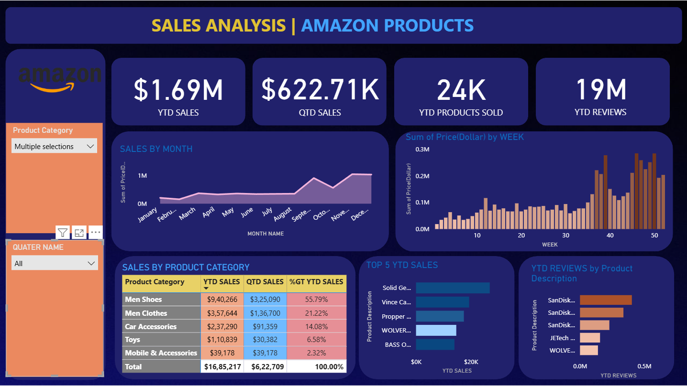

# 📊 Amazon Sales Dashboard – Power BI

This project showcases an interactive Power BI dashboard built to analyze Amazon sales performance.  
It provides meaningful insights into revenue trends, category performance, profitability, and customer behavior.

---

## 🖼️ Dashboard Preview

---

## 🔍 Key Insights

- Total Sales & Profit Overview  
- Monthly Sales Trend  
- Category & Subcategory Analysis  
- Region-wise Sales Comparison  
- Customer Segment Distribution  
- Top Selling Products  
- Ship Mode Analysis  

---

## 🎯 Purpose of the Dashboard

- Understand overall sales performance  
- Identify highest revenue categories  
- Track profit trends  
- Compare regional performance  
- Support data-driven decision making  

---

## 📁 Repository Contents

| File | Description |
|------|------------|
| AMAZON_PROJECT.pbix | Power BI dashboard source file |
| Amazon_Combined_Data.xlsx | Dataset used for analysis |
| Amazon_Dashboard.png | Dashboard preview image |
| README.md | Documentation |

---

## 📂 Dataset Details

The dataset includes:

- Order Date  
- Product Category / Subcategory  
- Region  
- Sales  
- Quantity  
- Profit  
- Customer Segment  
- Ship Mode  

---

## 🔧 Data Cleaning Performed

- Removed duplicates  
- Standardized date format  
- Calculated profit fields  
- Filtered invalid entries  
- Cleaned category names  

---

## 🛠️ Technologies Used

- Power BI  
- Excel  
- Power Query  
- DAX  

---

## 🧠 Skills Demonstrated

- Data Cleaning & Preparation  
- KPI Creation  
- Data Modeling  
- Dashboard Design  
- Business Analytics  
- Insight Interpretation  

---

## 👤 Developed By

**Kunal Chandelkar**
